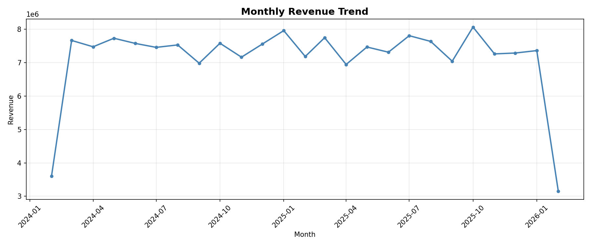
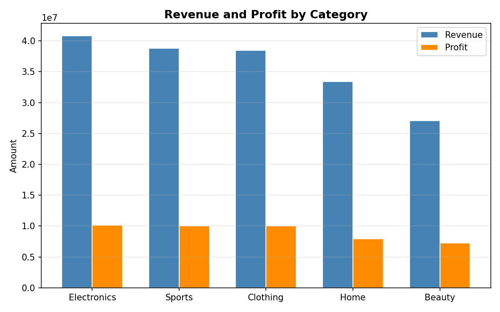
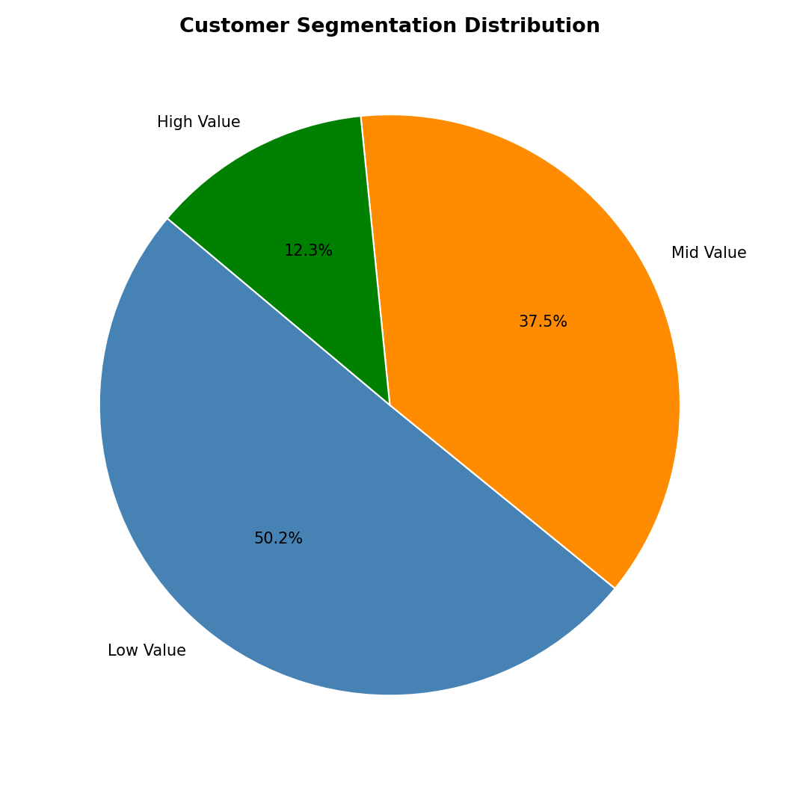
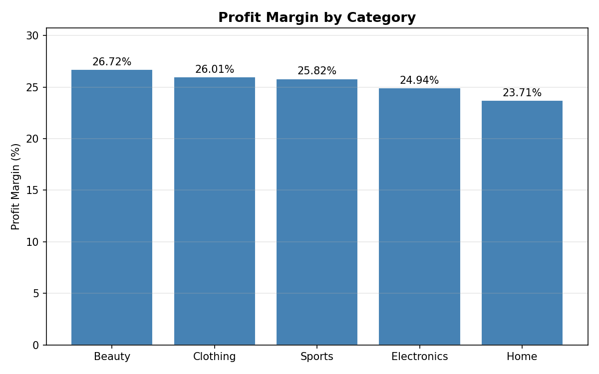
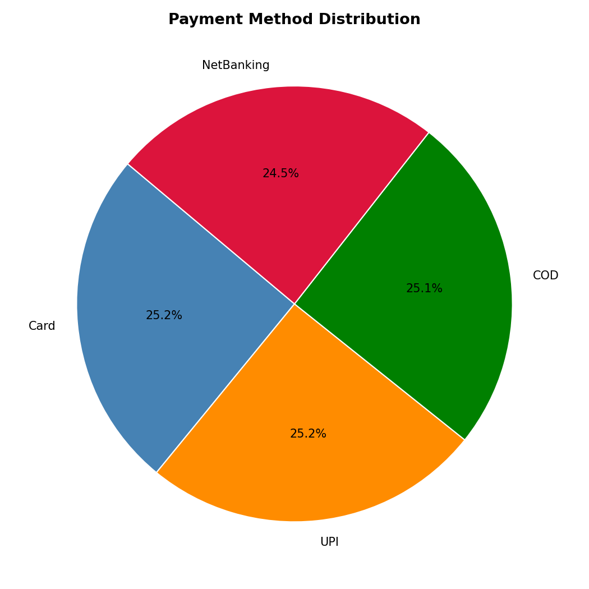

# E-Commerce Business Analytics Engine

A SQL-driven business analytics engine built on PostgreSQL, analyzing 2 years of simulated e-commerce operations across 10,000 customers, 200 products, and 50,000 orders.

---

## Business Questions Answered

- How has monthly revenue trended over time?
- Which product categories drive the most revenue and profit?
- What percentage of revenue comes from the top 10% of customers?
- How are customers segmented by purchase behavior?
- Which customer cohorts retain best over time?
- What is the repeat purchase rate and payment failure rate?

---

## Database Schema

6 related tables built in PostgreSQL:

| Table | Description |
|-------|-------------|
| customers | 10,000 customers with signup date and city |
| products | 200 products across 5 categories with cost and price |
| orders | 50,000 orders with status and timestamp |
| order_items | Line items per order with quantity and selling price |
| payments | Payment method, status and amount per order |
| returns | Returned items with refund amount |

---

## SQL Concepts Used

- CTEs (Common Table Expressions)
- Window Functions — RANK, NTILE, FILTER
- Multi-table JOINs
- Cohort Analysis
- RFM Customer Segmentation
- Revenue, Profit and Margin Calculations

---

## Key Results

- Top 10% of customers generate a disproportionate share of total revenue
- Cohort retention drops sharply after Month 1 — signals need for post-purchase engagement
- Profit margins vary significantly across categories despite similar revenue levels
- Payment failure rates differ by method — actionable for checkout optimization

---

## Business Recommendations

* **Retention drops after Month 1** — Launch a post-purchase email sequence triggered at Day 7 and Day 30 for first-time buyers. Focus on product education, reviews, and a small repeat-purchase discount to drive second orders.

* **Top 10% of customers drive disproportionate revenue** — Introduce a VIP loyalty tier for this segment with early access, exclusive offers, and dedicated support. Losing even a fraction of this group has outsized revenue impact.

* **Profit margins vary significantly across categories despite similar revenue** — Reduce paid marketing spend on low-margin categories and reallocate budget toward high-margin ones. Revenue alone is a misleading success metric here.

* **Payment failure rates differ by method** — Surface the highest-success payment methods first at checkout and run a targeted nudge campaign to shift users away from high-failure methods.

## Sample Output Charts

### Monthly Revenue Trend


### Revenue and Profit by Category


### Customer Segmentation


### Profit Margin by Category


### Payment Method Distribution


---

## Tech Stack

- PostgreSQL
- Python
- pandas, matplotlib, psycopg2

---

## How to Run
```bash
# 1. Set up PostgreSQL database and run schema
psql -U postgres -f database/schema.sql

# 2. Generate synthetic data
python data_generation/generate_data.py

# 3. Run SQL analysis files in order
psql -U postgres -f sql/01_revenue_analysis.sql
psql -U postgres -f sql/02_customer_analysis.sql
psql -U postgres -f sql/03_cohort_analysis.sql
psql -U postgres -f sql/04_product_analysis.sql

# 4. Generate visualizations
python src/visualize.py
```

Or open `analysis.ipynb` for the full end-to-end walkthrough with outputs.

---

## What I Learned

Building this project taught me how much of real business analytics lives in SQL — not just simple aggregations but window functions, cohort tracking, and multi-step CTEs that chain logic together. The cohort retention heatmap was the most challenging part to get right, requiring multiple CTEs to calculate months since acquisition correctly. If I were to extend this, I would connect it to a real dataset like the Olist Brazilian E-Commerce dataset on Kaggle and build a churn prediction model on top of the customer features generated here.
